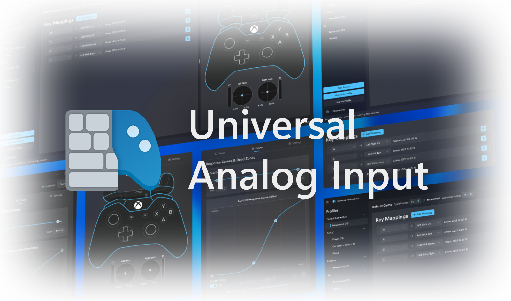
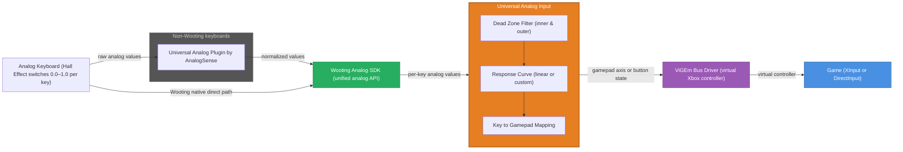
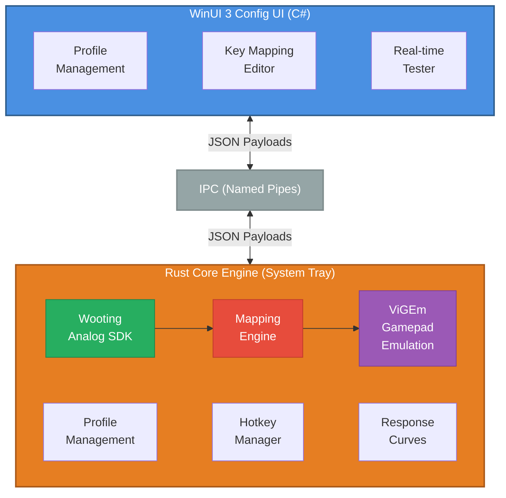

<p align="center">
  <picture>
    <source media="(prefers-color-scheme: light)" srcset="./doc/images/readme/uai-hero.light.png" />
    
  </picture>
</p>

<h1 align="center">
  <span>Universal Analog Input</span>
</h1>

<p align="center">
  <span align="center">Transform your analog keyboard input into gamepad controls for any game.</span>
</p>

<h3 align="center">
  <a href="#installation">Installation</a>
  <span> | </span>
  <a href="#features">Features</a>
  <span> | </span>
  <a href="#usage">Usage</a>
  <span> | </span>
  <a href="#contributing">Contributing</a>
</h3>

<p align="center">
  <a href="https://www.rust-lang.org"></a>
  
  
</p>

<br/>

## Overview

Universal Analog Input bridges the gap between analog keyboards and games that don't natively support them. It captures precise analog input from your keyboard and translates it into virtual gamepad controls, giving you smooth, proportional movement in any game that supports controllers.

### Why Universal Analog Input?

Most games treat keyboard input as binary (pressed or not pressed), resulting in all-or-nothing movement. In racing games, for example, pressing a key means full acceleration or full steering, there's no in-between. With analog keyboards, you can press keys partially, but most games don't recognize this capability.

Universal Analog Input solves this problem by converting your analog keyboard input into gamepad controls that games understand. Now you get:

- **Smooth, Proportional Control**: Press a key halfway for half acceleration or gentle steering, just like a controller analog stick
- **Perfect for Racing Games**: Fine control over steering and throttle without the all-or-nothing keyboard behavior
- **Fluid Movement**: In any game, control your character's speed and direction with precision
- **Full Customization**: Map any analog key to any gamepad control (sticks, triggers, buttons)
- **Game Profiles**: Create separate configurations for each game you play
- **Sub-Profiles**: Within each game, create different mapping sets for different situations (e.g., driving vs. walking, flight vs. ground combat)
- **Response Curves**: Fine-tune input response with linear or custom curves to match your play style
- **Hotkey Switching**: Instantly switch between sub-profiles during gameplay
- **Universal Compatibility**: Works with any analog keyboard supported by the Wooting Analog SDK plugin system

<br/>

In game experience :

<p align="center">
  
  
</p>

<br/>

## Video Demo

https://github.com/user-attachments/assets/36757e45-80f2-4242-9abb-7bc620788564

<br/>

## Features

### Core Capabilities

| Feature | Description |
|---------|-------------|
| **Analog Input Capture** | Integration with [Wooting Analog SDK](https://github.com/WootingKb/wooting-analog-sdk) to capture precise analog input values |
| **Virtual Gamepad Emulation** | [ViGEm](https://github.com/nefarius/ViGEmBus)-powered Xbox controller emulation |
| **Flexible Key Mapping** | Map any analog keyboard key to gamepad sticks, triggers, or buttons |
| **Response Curves** | Choose from linear or custom interpolated response curves |
| **Dead Zone Configuration** | Inner and outer dead zones for precise control calibration |
| **Profile Management** | Save separate configurations for each game you play |
| **Sub-Profile System** | Multiple mapping sets per game for different situations (driving, walking, etc.) |
| **Hotkey Switching** | Instantly switch between sub-profiles during gameplay |
| **Real-time Visualization** | Live input monitoring in the "Tester" tab |
| **Error Monitoring** | Optional [Sentry](https://sentry.io) integration for crash reports and stability metrics |

### Advanced Features

- **Profile Import/Export**: Share configurations with the community
- **Custom Response Curves**: Define up to 12 control points with Hermite interpolation
- **Native Windows Integration**: Modern WinUI 3 interface with Windows 11 styling
- **System Tray Operation**: Runs in the background with minimal footprint

<br/>

## Installation

### Prerequisites

Before installing Universal Analog Input, ensure you have:

1. **Windows 10/11** (version 1903 or later)
2. **Analog Keyboard** - Wooting or any keyboard supported via the [Universal Analog Plugin](https://github.com/AnalogSense/universal-analog-plugin)

### Download

**Installer (Recommended)**

Download the latest installer: [UniversalAnalogInput-Setup-v1.0.1.exe](https://github.com/Ritonton/UniversalAnalogInput/releases/latest)

The installer automatically handles:
- Universal Analog Input application installation
- ViGEm Bus Driver (virtual gamepad emulation)
- Wooting Analog SDK with plugin support
- Start Menu shortcuts
- Clean uninstallation utility

<details>
<summary><b>Build from Source</b></summary>

Alternatively, you can build from source:

**Requirements:**
- [.NET 9 SDK](https://dotnet.microsoft.com/download/dotnet/9.0)
- [Rust toolchain](https://rustup.rs/)
- [Visual Studio 2022](https://visualstudio.microsoft.com/) with Windows App SDK (optional, for UI development)

**Build Steps:**
```bash
# Clone the repository
git clone https://github.com/Ritonton/UniversalAnalogInput.git
cd universal-analog-input

# Build everything (Rust core + C# interface)
.\scripts\build.ps1

# Package for local distribution (creates UniversalAnalogInput.exe + published UI folder)
.\scripts\package.ps1 -SelfContained

# The executable will be in the output directory
```

</details>

<br/>

## Usage

### Quick Start Guide

1. **Connect Your Analog Keyboard**
   - Plug in your keyboard before launching the app

2. **Launch Universal Analog Input**
   - Run `UniversalAnalogInput.exe`
   - The system tray icon will appear
   - The configuration interface opens automatically on first run
   - Verify your keyboard is detected in the app

3. **Create Your First Profile**
   - Click "New Profile" to create a game configuration
   - Name it after your game (e.g., "GTA V")
   - Add sub-profiles if needed (e.g., "Driving", "On Foot")

4. **Map Your Keys**
   - Select a key from the "Supported Keys" list
   - Choose a gamepad control (stick, trigger, or button)
   - Configure response curve and dead zones in "Curves" tab
   - Click "Add Mapping"

5. **Test Your Configuration**
   - Switch to the "Tester" tab
   - Press your mapped keys and watch the gamepad visualization
   - Adjust curves and dead zones as needed

6. **Start Playing**
   - Click "Start Mapping" to activate your profile
   - Launch your game (it must support Xbox-style controllers)
   - The mapping runs in the background via the system tray

> [!IMPORTANT]
> **Avoid key conflicts in your game's settings.** When UAI is active, your analog keys are translated into gamepad inputs. If your game also has those same keyboard keys bound to an action, the game will receive *both* a gamepad signal and a keyboard signal on the same action simultaneously, causing erratic behavior. To prevent this, go to your game's key bindings and **unbind any key you have mapped in UAI** (set it to "None"), or reassign it to an unused key.

### Profile Management

**Creating Sub-Profiles**
- Sub-profiles are different mapping sets within a single game profile
- Use them for different situations in the same game (e.g., driving vs. walking, flight vs. ground combat)
- Example: GTA V with "On Foot" and "Driving" sub-profiles
- Assign hotkeys to quickly switch between sub-profiles during gameplay

**Import/Export Profiles**
- Share your configurations with the community
- Click "Export Profile" to save as JSON
- Click "Import Profile" to load shared configurations

**Hotkeys**
- Assign a hotkey to cycle through sub-profiles
- Set individual hotkeys for specific sub-profiles
- Hotkeys work even when the interface is closed

<br/>

## Architecture

Universal Analog Input uses a hybrid architecture separating the core engine from the user interface.

<details>
<summary><b>Analog Data Flow</b></summary>

### From Key Press to Game Input



The **Universal Analog Plugin** is only needed for non-Wooting keyboards. Wooting keyboards communicate directly with the Wooting Analog SDK. In both cases, UAI receives the same normalized per-key values (0.0 – 1.0), applies dead zones and response curves, and forwards the result to ViGEm as a virtual Xbox controller that the game sees as a real gamepad.

</details>

<details>
<summary><b>Architecture Details</b></summary>

### Component Overview



### Technology Stack

**Rust Core Engine (`/native`)**
- High-performance input processing
- Wooting Analog SDK integration with plugin support
- ViGEm gamepad emulation
- IPC server for communication with UI
- System tray application

**C# Configuration Interface (`/ui`)**
- WinUI 3 for modern Windows interface
- Dependency injection with ServiceLocator pattern
- Real-time input visualization
- IPC client for communication with core

**Key Technologies**
- [Wooting Analog SDK](https://github.com/WootingKb/wooting-analog-sdk) - Analog keyboard input with plugin system
- [Universal Analog Plugin](https://github.com/AnalogSense/universal-analog-plugin) - Multi-keyboard compatibility
- [ViGEm](https://github.com/nefarius/ViGEmBus) - Virtual gamepad emulation
- [WinUI 3](https://docs.microsoft.com/windows/apps/winui/) - Modern Windows interface
- Rust + C# IPC - Separate processes communicating via Windows named pipes (JSON payloads)

</details>

<br/>

<details>
<summary><b>Project Structure</b></summary>

```
universal-analog-input/
├── native/                      # Rust core engine
│   ├── src/
│   │   ├── bin/
│   │   │   └── tray.rs          # System tray application (entry point)
│   │   ├── lib.rs               # Core library
│   │   ├── conversions.rs       # Conversion tables
│   │   ├── curves.rs            # Response curve evaluation
│   │   ├── api/                 # IPC API definitions
│   │   ├── ipc/                 # IPC server implementation
│   │   ├── mapping/             # Mapping engine
│   │   ├── gamepad/             # ViGEm gamepad emulation
│   │   ├── wooting/             # Wooting SDK integration
│   │   ├── profile/             # Profile management
│   │   └── input/               # Hotkey system
│   ├── Cargo.toml
│   └── build.rs
├── ui/                          # C# WinUI 3 interface
│   └── UniversalAnalogInputUI/
│       ├── Views/               # XAML pages
│       ├── Services/            # Business logic
│       ├── Controls/            # Custom controls
│       ├── Models/              # Data models
│       ├── Dialogs/             # UI dialogs
│       └── Helpers/             # Utility functions
├── shared/                      # Shared resources
│   └── configs/                 # Default profiles
└── scripts/                     # Build automation
    ├── build.ps1                # PowerShell build script
    ├── package.ps1              # Packaging script
    └── create-release.ps1       # Release creation script
```

</details>

## Development

<details>
<summary><b>Building the Project</b></summary>

**Quick Build (Development)**
```powershell
# Build everything
.\scripts\build.ps1

# Build only Rust core
cd native
cargo build

# Build only C# interface
cd ..\ui
dotnet build
```

**Package for Distribution**
```powershell
# Create self-contained package (includes .NET runtime)
.\scripts\package.ps1 -SelfContained

# Create release ZIP
.\scripts\create-release.ps1 -Version "1.0.0"
```

**Visual Studio Development**
1. Open `ui\UniversalAnalogInputUI.sln`
2. Set configuration to `x64 | Release`
3. Build and run with F5

</details>

<details>
<summary><b>Development Commands</b></summary>

**Rust Development**
```bash
cd native
cargo check          # Fast syntax checking
cargo clippy         # Linting
cargo fmt            # Format code
cargo run --bin uai-tray  # Run tray application
```

**C# Development**
```bash
cd ui
dotnet build         # Build solution
dotnet run           # Run application
dotnet clean         # Clean artifacts
```

</details>

<br/>

## Contributing

Contributions are welcome! Here's how you can help:

### Ways to Contribute

- Report bugs - Open an issue with reproduction steps
- Suggest features - Share your ideas for improvements
- Improve documentation - Help others understand the project
- Submit pull requests - Fix bugs or add features
- Share profiles - Contribute game configurations

### Development Guidelines

1. **Follow existing code style**
   - Rust: Use `cargo fmt` and `cargo clippy`
   - C#: Follow Microsoft conventions

2. **Update documentation**
   - Update README.md for user-facing changes

3. **Keep it simple**
   - Write clean, readable code
   - Avoid unnecessary complexity

### Pull Request Process

1. Fork the repository
2. Create a feature branch (`git checkout -b feature/amazing-feature`)
3. Commit your changes (`git commit -m 'Add amazing feature'`)
4. Push to the branch (`git push origin feature/amazing-feature`)
5. Open a Pull Request

<br/>

## Compatible Hardware

Universal Analog Input works with two categories of devices depending on whether the [Universal Analog Plugin](https://github.com/AnalogSense/universal-analog-plugin) by AnalogSense is installed.

### Without Universal Analog Plugin — Wooting keyboards only

| Keyboard |
|----------|
| All Wooting keyboards with analog mode |

### With Universal Analog Plugin — extended compatibility

The plugin bridges third-party analog keyboards to the Wooting Analog SDK, enabling support for all devices below.

| Keyboard | Notes |
|----------|-------|
| Razer Huntsman V2 Analog | [R] |
| Razer Huntsman Mini Analog | [R] |
| Razer Huntsman V3 Pro | [R] |
| Razer Huntsman V3 Pro Mini | [R] |
| Razer Huntsman V3 Pro Tenkeyless | [R] |
| NuPhy HE-series keyboards *(Hall Effect line only)* | |
| DrunkDeer (all models) | |
| Keychron Q1 HE | [P] [F] |
| Keychron Q3 HE | [P] [F] |
| Keychron Q5 HE | [P] [F] |
| Keychron K2 HE | [P] [F] |
| Lemokey P1 HE | [P] [F] |
| Madlions MAD60 HE | [P] |
| Madlions MAD68 HE | [P] |
| Madlions MAD68R | [P] |

**Notes:**

- **[R]** Razer Synapse must be installed and running for analog inputs to be received from this keyboard.
- **[P]** The official firmware only supports polling, which can lead to lag and missed inputs.
- **[F]** [Custom firmware with full analog report functionality is available.](https://analogsense.org/firmware/)

> [!NOTE]
> For NuPhy, only keyboards in the **HE (Hall Effect) line** are supported — not all NuPhy keyboards. These are the models equipped with Hall Effect switches and the appropriate motherboard for analog output.

<br/>

## System Requirements

### Minimum Requirements
- Windows 10 version 1903 (build 19041) or later
- Analog keyboard (Wooting or plugin-supported)
- ViGEm Bus Driver installed
- Wooting Analog SDK with plugin support
- 50 MB free disk space
- 100 MB RAM

### Recommended Requirements
- Windows 11 (latest version)
- 200 MB RAM for optimal performance

<br/>

## License

This project is licensed under the MIT License - see the [LICENSE](LICENSE) file for details.

For information about third-party dependencies and their licenses, see [THIRD_PARTY_LICENSES.md](THIRD_PARTY_LICENSES.md).

<br/>

## Acknowledgments

- **Wooting** - For the analog keyboard SDK and plugin system
- **AnalogSense** - For the Universal Analog Plugin enabling multi-keyboard support
- **Nefarius** - For the ViGEm virtual gamepad driver
- **Microsoft** - For WinUI 3 and .NET
- **Rust Community** - For excellent tooling and libraries

<br/>

## Known Issues

- **NavigationView crash when modifying profiles**: Adding or deleting profiles can trigger a COMException (0x80004005) in WinUI 3's NavigationView control. This is a known framework bug where dynamically clearing and re-adding navigation items corrupts the internal pane binding, causing the navigation pane to freeze. Tracked here: [microsoft/microsoft-ui-xaml#10894](https://github.com/microsoft/microsoft-ui-xaml/issues/10894)

<br/>

## Important Notes

- **Xbox Controller Emulation Only**: This application currently only supports Xbox-style controller emulation via ViGEm. PlayStation and other controller types are not supported yet
- **Game Compatibility**: Your game must support Xbox controllers for this application to work

<br/>

## Privacy & Telemetry

Universal Analog Input includes **optional** error monitoring and crash reporting via [Sentry](https://sentry.io).

<details>
<summary><b>Detailed Privacy Information</b></summary>

### Built from Source (Open-Source)

If you **build from source**:
- Sentry is **disabled by default** - you must set a DSN in the `.env` file to enable it
- Set `UI_SENTRY_DSN` and `NATIVE_SENTRY_DSN` environment variables to enable monitoring
- Leave them empty or unset to disable completely

### Official Releases (Distributed Binary)

If you **download the official release installer**:
- Sentry is **enabled by default** to help improve stability and fix bugs faster
- **No personal information (PII) is collected** (`send_default_pii: false`)
- Crash reports are sent to Sentry servers only when crashes occur
- You can **disable Sentry at any time** by editing or removing the `.env` file (see below)

### How to Disable Sentry in Official Release

Edit `%LOCALAPPDATA%\UniversalAnalogInput\.env`:
```bash
# Comment out or remove these lines to disable Sentry:
#UI_SENTRY_DSN=...
#NATIVE_SENTRY_DSN=...
```

Or simply delete the `.env` file entirely, the application will run without Sentry monitoring.

For full details, see [PRIVACY_POLICY.md](PRIVACY_POLICY.md) and [TERMS_OF_SERVICE.md](TERMS_OF_SERVICE.md).

</details>

<br/>

## Changelog

**Current Version: 1.0.1** (January 14, 2026)

### Latest Release Highlights
- **Sentry Integration** - Automatic crash reporting (can be disabled)
- **Legal Documentation** - GDPR-compliant privacy and terms
- **Improved Error Tracking** - Better bug identification and fixing
- **Session Monitoring** - Release health and stability metrics

See [CHANGELOG.md](CHANGELOG.md) for complete version history and upgrade guide.

<br/>

## Support

- **Issues**: [GitHub Issues](https://github.com/Ritonton/UniversalAnalogInput/issues)

<br/>

---

<p align="center">
  Made for the analog keyboard community
</p>
